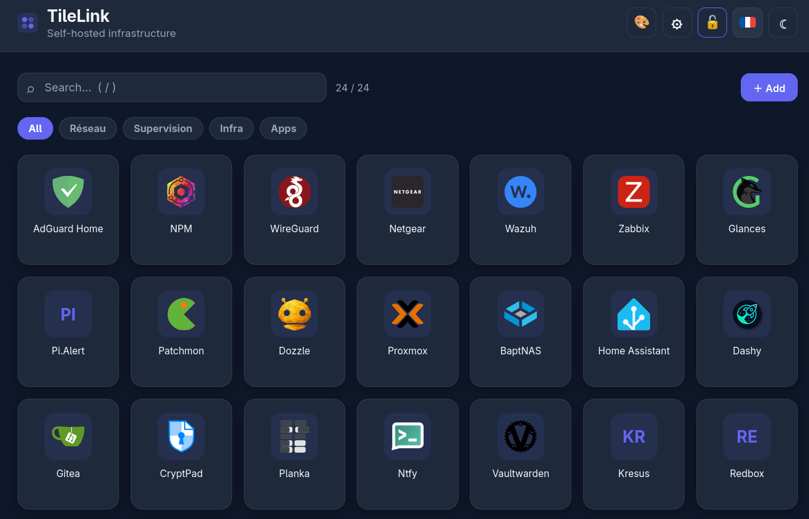

# TileLink



Self-hosted **tile dashboard** (MyApps / Okta style). A lightweight, grid-based
alternative to link pages — with **tile management right in the UI** (admin team).

- Vanilla frontend (zero dependencies), Node backend (stdlib only, no DB).
- Manual config in **`config.yaml`**, UI-created tiles in **`custom.json`** (merged at display time).
- Icons via [dashboardicons.com](https://dashboardicons.com/) (jsDelivr CDN), direct URL, local file or **upload** (auto-resized to 256×256).
- Responsive grid: column count adapts to width, long names wrap on 2 lines.
- Instant search (case- and accent-insensitive, `/` to focus, `Esc` to clear).
- **Public** read access (viewers), write access restricted to the admin team (`ADMIN_TOKEN`).
- Bilingual FR/EN (header button, stored per browser, auto-detected).

## Quickstart (Docker Compose)

```bash
# 1. Create your personal config from the examples (never committed):
cp config.example.yaml config.yaml
cp custom.example.json custom.json

# 2. Choose an admin password (.env file next to the compose file):
echo 'ADMIN_TOKEN=a-strong-password' > .env

# 3. Build & run:
sudo docker compose up -d --build
# then http://localhost:8080
```

Your real `config.yaml`, `custom.json`, `icons/` uploads and `.env` are git-ignored —
only the examples live in this repo, so it is safe to fork.

## Add a tile manually (config.yaml)

Edit `config.yaml` (mounted as a volume, live reload, no rebuild needed):

```yaml
links:
  - name: "Home Assistant"
    url: "https://homeassistant.home.example.com/"
    icon: "home-assistant"   # dashboard-icons slug, URL or icons/file.svg
```

`icon` field, 3 options:
1. **dashboard-icons slug** — e.g. `home-assistant`, `proxmox`, `gitea`.
   Catalog: https://dashboardicons.com/icons (slug = end of the URL).
2. **Full URL** — e.g. `https://example.com/logo.svg`.
3. **Local file** — drop it into `./icons/`, then `icon: "icons/my-app.svg"`.

If the icon cannot be found, an initials badge is shown instead.

## Group with categories + environment badges

Two optional fields per tile:

```yaml
links:
  - name: "Portainer PROD"
    url: "https://portainer.home.example.com/"
    icon: "portainer"
    category: "Containers"   # generates a filter button
    env: "prod"              # colored badge: prod / staging / dev
```

- `category`: filter buttons are generated automatically, in order of appearance.
  No `category` → “Others” button. Hidden when there is a single category.
- `env`: badge on the top-right of the tile (green = prod, orange = staging,
  blue = dev, gray = any other value). Handy for multiple instances of one tool.
- Search and category filter combine (search also matches the category name).

## Add a tile from the UI (admin team)

Click “＋ Add” (or the 🔒 in the header) → admin password asked once → form:
name, URL, icon (slug / URL **or** uploaded image resized to 256×256 PNG in
`icons/`), category (auto-suggest), env. Live preview of what the tile will look
like. On save, a dashboard-icons slug is **downloaded and pinned into `icons/`**
(works offline afterwards; unknown slugs keep the CDN reference and fall back
to initials). Stored in `custom.json` (auto `.bak` backup), visible to everyone
immediately. Delete with ×, **edit with ✎** (same pre-filled form — e.g. to add
an icon later). Both only in admin mode and only for UI-created tiles
(`config.yaml` tiles stay hand-managed).

## Roles

- **Viewers** (non-admin teams): read-only, no password.
  ⚙ button: display preferences (large / small tiles, stored in the browser;
  when small, long names wrap on 2 lines).
- **Admins**: shared password (`ADMIN_TOKEN`), remembered for the session.
  The 🔒 header button locks/unlocks editing (✎/×); “＋ Add” opens the form
  (password asked there if locked).
- 🎨 button (admin mode): **branding** — logo (URL or 128px upload), title and
  subtitle seen by everyone. Empty field = `config.yaml` value.
  Stored in `custom.json` (`settings` section).
- No private tiles: everyone sees the same dashboard.

## Local dev (no Docker)

```bash
ADMIN_TOKEN=dev node server.js   # http://localhost:3000
```

## Layout

```
├── index.html          # skeleton + header + modals
├── style.css           # dark/light theme + grid + modals
├── app.js              # merges config.yaml + custom.json, search, filters, admin (vanilla JS)
├── server.js           # Node stdlib backend: static + admin API (no DB)
├── config.example.yaml # copy to config.yaml and make it yours (git-ignored)
├── custom.example.json # copy to custom.json (git-ignored, written by the UI)
├── icons/              # local icons + uploads (git-ignored, see .gitkeep)
├── Dockerfile          # node:22-alpine
└── compose.yaml        # port 8080 + config/custom/icons volumes + ADMIN_TOKEN
```

## License

MIT — fork it for your homelab.
